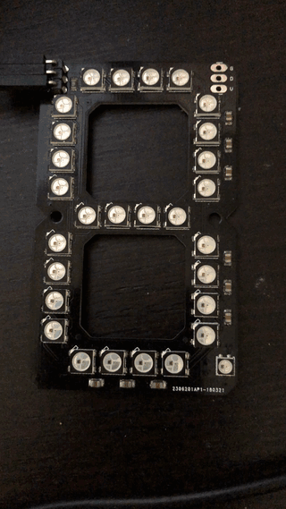

# micropython-neo7segment
A MicroPython driver for the [Neo7Segment](https://www.tindie.com/products/seonr/neo7segment-display/) display.

## Examples

See the [`examples`](examples) directory. 

Note that it's possible to run example code _without_ hardware on regular CPython - but instead of a lovely seven-segment rendering with neopixels you'll have RGB values for each neopixel printed out. See [`display_all_fake.py`](examples/display_all_fake.py).

For amore authentic experience, copy [`display_all.py`](examples/display_all.py) to a MicroPython-powered board, connect a Neo7Segment to it (Pin 17 by default) and execute the code. 

## Basic Usage
```python
import utime as time
from neopixel import NeoPixel
from machine import Pin

neo = NeoPixel(Pin(17), 29, timing=True)
neo7 = Neo7Segment(neo, 1)

display_string = '1234567890.abcdef'
for char in display_string:
    neo7.display(char, (0, 0, 1))
    time.sleep_ms(250)
```


